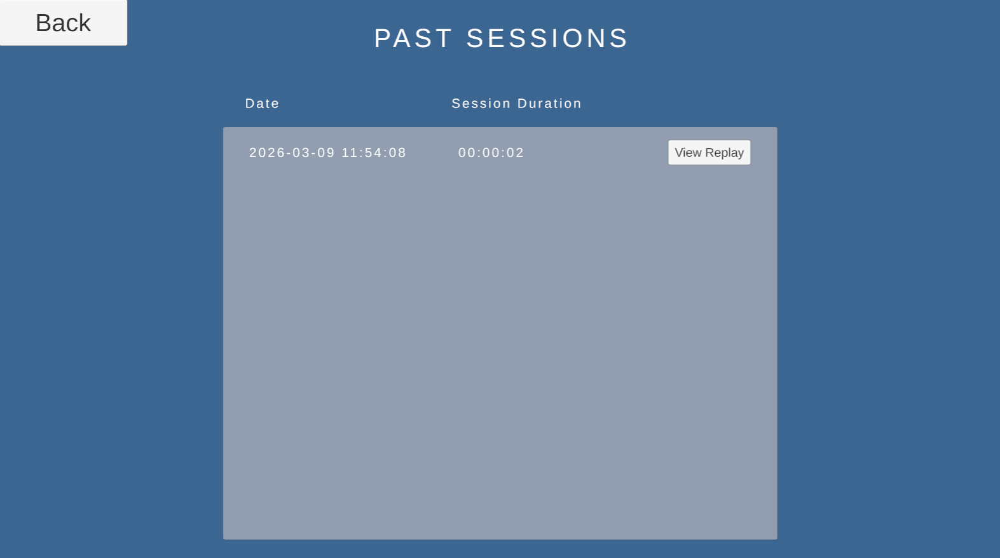
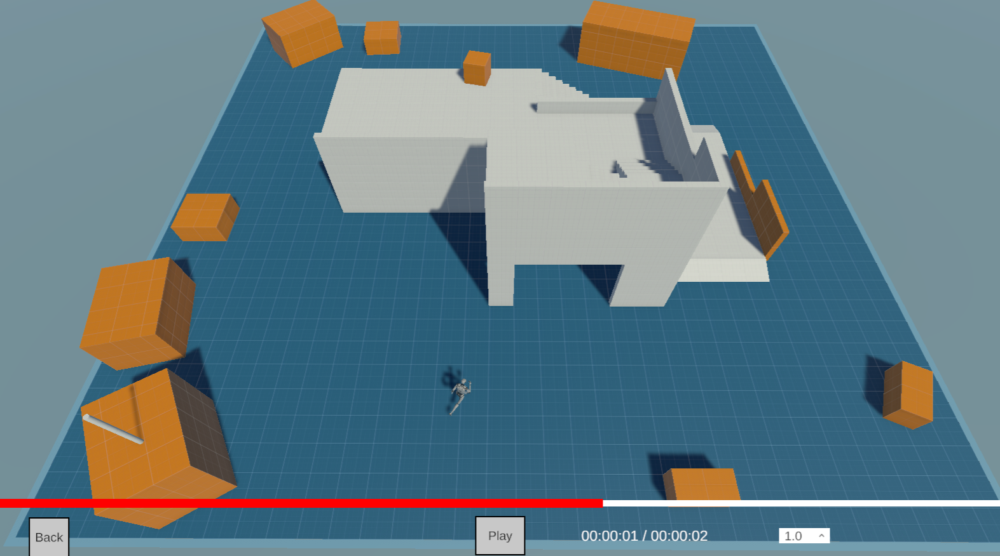

# Replay System

A simple replay system that records and plays back an object's position, rotation, and animation state with video-style controls.

## Features
- Records position, rotation, and animation state per frame
- Saves replays as compressed JSON (using MemoryStream)
- Metadata file for each session (date + duration)
- "Past Sessions" table that automatically scans a 'Sessions' folder located in the same location as the exe file
- Video-style playback controls:
  - Play / Pause
  - Timeline scrubbing
  - Playback speed control

## Folder Structure
Sessions/  
├── 2026-03-09_11-54-06/  
│   ├── replay ← compressed JSON  
│   └── metadata.json ← date + duration  
└── ...

## Screenshots

## How to Use
1. Open the project in Unity 6000.3+
2. Click on "Project" on the top menu and click Load Scene -> Standby (Play Immediately)
3. Click on the "Start Game" button to start recording
4. Once done, press the ESC key to save the replay and go back to the menu
5. Click on the "Past Sessions" button to view all the saved replays
6. Click on the "View Replay" button on the list entry to view the replay

## Technical Highlights
- Frame-by-frame data storage
- Custom compression using `MemoryStream` + JSON
- Automatic folder scanning and session discovery

**Note**: This is a minimal, self-contained demo created to showcase my current C# coding style and approach to real-time recording/playback systems. It is a simplified recreation of concepts I have implemented in professional enterprise simulation projects (which are under NDA and cannot be shared publicly).